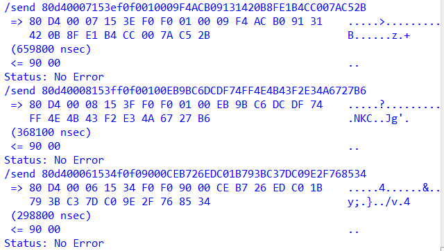

####代码来自14级姚云龙师兄

### 第一章 Java智能卡的设计概要

#### 1.1 项目背景与意义

&emsp;&emsp;随着无线射频识别技术（英语：Radio Frequency IDentification，缩写：RFID）的快速发展，Java智能卡也逐步走进日常生活。

&emsp;&emsp;RFID通过无线电讯号识别特定目标并读写相关数据，而无需识别系统与特定目标之间建立机械或者光学接触。无线电的信号是通过调成无线电频率的电磁场，把数据从附着在物品上的标签上传送出去，以自动辨识与追踪该物品。某些标签在识别时从识别器发出的电磁场中就可以得到能量，并不需要电池；也有标签本身拥有电源，并可以主动发出无线电波（调成无线电频率的电磁场）。标签包含了电子储存的信息，数米之内都可以识别。与条形码不同的是，射频标签不需要处在识别器视线之内，也可以嵌入被追踪物体之内。

&emsp;&emsp;智能卡是一种芯片卡，计算芯片镶嵌在一张名片大小的塑料卡片上，从而完成数据的存储与计算。可以通过一种叫读卡器的设备访问智能卡中的数据。

&emsp;&emsp;由于智能卡在当今网络系统应用中拥有着突出的两大重点：个人身份性和密文性，因此被广泛应用于银行、通信、交通等系统。个人身份性是指智能卡可以表明持卡人的身份。当今各式各样的交易最终都要确认交易方的身份。而智能卡通过存储在卡里的一个ID号就可以方便的表明你的身份了。既简单又安全。密文性是指智能卡可以以密文的形式存储某些数据。有些智能卡还能利用自带的微处理器进行动态的数据加减密。充分利用智能卡的个人身份性和密文性，就可以为任何类型网络的数据传递和身份认证提供安全性，从而能大幅度提高现行系统的安全性和便利性。

&emsp;&emsp;除此之外，智能卡还有：大容量性，稳定性，可携带性，兼容性好等特点。

#### 1.2 Java智能卡发展现状

按嵌入的芯片种类分，智能卡可以分为以下几类：

- 接触式卡

   这种卡需要一种叫作读卡器的装置进行信息的读写操作。与信用卡上是一个磁带条不同，这种卡的表面上镶嵌着一个小的金属片，当把卡插入读卡器时，这个小金属片就会同一个电子接头相接触，通过这个电子接头对芯片读写数据。从卡的结构来分，接触式卡主要分为以下两类卡：

  - 存储卡 
    存储卡不包含复杂的处理器，它不能动态的管理文件。存储卡与读卡器的通信是同步通信。IC电话机中的IC卡就是存储卡。
  - 微处理器卡 
    微处理器卡是我们在这要主要讨论的。她与存储卡的最大的区别就是：她具有动态处理数据的功能。微处理器卡的系统结构有的象PC机。她也有ROM，RAM，CPU和EEPROM。以下的讨论如无特别指出，讨论的对象都是微处理器卡。象SIM卡，银行卡等都是微处理器卡。

- 非接触式卡 
  另一种是非接触式智能卡，这种卡看上去和普通的塑料信用卡很相似，但却在卡体中内嵌了一个天线和一个微电子芯片，当把它放近读卡器的天线时，它们之间就可以完成一次信息交换。这使其不用与耦合感应器做任何接触，就可与之交换信息，并且处理时间极短，这一特性，使非接触式智能卡在一些象高速公路收费站这样要求大批量超快速运转的场所成为理想的解决方案。

&emsp;&emsp;智能卡能在世界各地推广，在不同系统中发挥她的作用，国际规范的制定是必不可少的。例如，智能卡的尺寸是由ISO7810标准规定的。ISO7816标准规定了卡用塑料的一些物理特性，包括温差范围、弹性、电子触点的位置以及内置微芯片和外界进行信息交换的方式等。

&emsp;&emsp;例如根据智能卡规范(ISO7816.1)，接触式智能卡共有8个触点，定义如下表。智能卡正是通过这8个触点与外界进行通信的。

| 触点   | 定义       | 触点   | 定义           |
| ---- | -------- | ---- | ------------ |
| C1   | Vcc 供电电压 | C5   | GND 接地       |
| C2   | RST 重置信号 | C6   | Vpp 编程电压     |
| C3   | CLK 时钟信号 | C7   | I/O 数据输入/ 输出 |
| C4   | 保留       | C8   | 保留           |
其中ISO7816是接触式卡智能卡必须遵循的国际规范。目前ISO7816已经陆续发布了9个部分:

- ISO7816-1：接触式卡智能卡的物理特性
- ISO7816-2：接触式卡智能卡触点的尺寸与位置
- ISO7816-3：接触式卡智能卡的电信号和传输协议
- ISO7816-4：接触式卡智能卡与外界交互的接口
- ISO7816-5：接触式卡智能卡应用的命名方式与注册系统
- ISO7816-6：接触式卡智能卡与外界交互的数据对象
- ISO7816-7：接触式卡智能卡的结构化查询语句
- ISO7816-8：接触式卡智能卡与安全有关的指令
- ISO7816-9：接触式卡智能卡附加指令与安全参数

&emsp;&emsp;从ISO7816规范的发展，我们可以清楚地看到接触式智能卡的从简单到复杂慢慢完善的发展轨迹。ISO7816是研究接触式智能卡的基础，如果你对接触式智能卡感兴趣，那ISO7816可是必不可缺的资料。

&emsp;&emsp;针对某些特殊的应用，如数字蜂窝式移动电话、信用卡（象Europay卡、Mastercard卡和 Visa卡）、电子钱夹（象Visacash、Multos与Proton）也制订了一系列相应的标准。例如，在中国应用最多最广泛的GSM系统中的SIM卡就得遵循GSM11.11, GSM11.14, GSM03.40等一系列规范。

而我们这次讨论的主题JAVA卡，她首先遵循ISO7816的规范,除此之外，她还遵循JAVA卡的一些规范：

- Java Card 2.1.1 Runtime Environment Specification
- Java Card 2.1.1 Virtual Machine Specification
- Java Card 2.1.1 Application Programming Interfaces Specification

如今，智能卡在各行各业都扮演着重要的角色：

- 电信业 
  智能卡在电信业中最著名的应用是：GSM中的SIM卡，和IC电话机中的IC卡。 
  SIM卡是GSM网络中的个人身份模块，即SIM卡中有一个ID来唯一确定该卡的身份。这个ID号会被GSM的鉴权中心，计费中心等使用。 
  IC电话机中的IC卡中存储着剩余话费的金额。IC电话机会依据通话时间，通话的费率对IC卡存储的金额进行扣除。
- 银行业 
  银行业是智能卡展示才华的另一舞台。离线交易是智能卡的一大卖点。通过复杂的加减密算法，和完善的密钥管理系统，POS终端的对银行智能卡进行离线的交易处理，而无须每次交易都用MODEM拨号到后台数据库进行查询。
- 交通运输 
  交通运输是智能卡另一个舞台，一种叫非接触式卡的智能卡在这一领域扮演主要角色。如香港地铁的“八达通”卡，用户进入地铁站时，只要将“八达通”卡在人口处的一个装置上晃一下，地铁人口处的门就会自动打开，同时“八达通”卡上的存储的余额就会变少。当“八达通”卡上的存储的余额变为零时，用户就需要对卡进行充值。

#### 1.3 项目设计内容

&emsp;&emsp;项目设计了一个具有圈存、消费、余额查询、身份识别功能且足够安全的Java智能卡电子钱包。分为三部分完成：电子钱包的文件系统，电子钱包的安全管理以及电子钱包的功能。

&emsp;&emsp; 电子钱包的文件系统流程图如下 


&emsp;&emsp; 电子钱包的安全管理流程图如下


&emsp;&emsp; 电子钱包的功能流程图如下


#### 1.4 项目设计的人员分工与进度

&emsp;&emsp; 项目设计由本人独自完成，进度如下

| 项目内容 |  时间进度   |
| :--: | :-----: |
| 文件系统 |  第14周   |
| 安全管理 |  第15周   |
|  功能  | 第16、17周 |

### 第二章 电子钱包应用的设计过程

####2.1 电子钱包应用的主要流程

&emsp;&emsp;浏览process()函数，先检查Applet是否为空，为空则退出。然后取出缓冲区的内容，代码中的getBuffer函数实际上是用一个指针指向了缓冲区，因此缓冲区的所有变化都会实时更新到apdu_buffer数组中。而setIncomingAndReceive函数则将终端发送过来的apdu命令读取到卡片的缓冲区中，这个函数每次只接受一个apdu命令，不过在这次项目中已经足够使用了。

```java
//步骤1:取APDU缓冲区数组引用并将之赋给新建数组
byte apdu_buffer[] = apdu.getBuffer();
//步骤2：取APDU缓冲区中数据放到变量papdu
//将apdu读取到卡片缓冲区当中并返回data段的长度  
short lc = apdu.setIncomingAndReceive();
```

&emsp;&emsp;然后从apdu_buffer数组中取出指令的各个部分的内容，如cla、ins、p1、p2等。指令的结构如下


&emsp;&emsp;取出cla等只占一个字节的内容只需要将数组按对应位赋值即可，取出长度可变的数据段内容时，则需要使用函数`Util.arrayCopyNonAtomic()` 将apdu_buffer数组从第5位开始的lc长度的内容复制给data。

```java
papdu.cla = apdu_buffer[0];  
papdu.ins = apdu_buffer[1];  
papdu.p1 = apdu_buffer[2];  
papdu.p2 = apdu_buffer[3];
//将buffer数组中从第5位开始将lc长度的内容复制到data数组
Util.arrayCopyNonAtomic(apdu_buffer, (short)5, papdu.pdata, (short)0, lc);
```

&emsp;&emsp;之后则根据ins对指令进行解析，并跳转执行不同的函数，执行完成后将卡片的返回值写进缓冲区，然后再使用setOutgoingAndSend函数将缓冲区的内容发送回给终端即可。

```java
Util.arrayCopyNonAtomic(papdu.pdata, (short)0, apdu_buffer, (short)5, (short)papdu.pdata.length);  //将返回值写入缓冲区
apdu.setOutgoingAndSend((short)5, papdu.le);//把缓冲区的数据返回给终端 
```

&emsp;&emsp;流程图如下：


####2.2 设计阶段综述

电子钱包的设计分为三个阶段：

1. 文件系统。实现了向电子钱包中读写二进制数据以及写密钥的功能。
2. 安全管理。实现了3DES算法以及生产MAC/TAC的GMAC算法。
3. 功能完善。实现了电子钱包的圈存、消费、余额查询等功能。

&emsp;&emsp;第一阶段的文件系统完成后，让Java智能卡可以通过读写二进制数据的方式来写入/读取持卡人的基本文件和应用基本文件，Java智能卡的个人身份性也体现在这里。而写密钥则将Java智能卡运行过程中所需要的密钥写入卡片中，是Java智能卡密文性的基础。

&emsp;&emsp;第二阶段的3DES算法用于生成过程密钥，而使用的密钥则来自第一阶段中写入卡片的密钥。生成过程密钥的输入数据中包含随机数，因此每次指令的执行的过程密钥都是不同的，这样更好的避免密钥被破解从而引发安全性的问题。GMAC算法使用过程密钥来得到MAC/TAC，保证交易的安全性。

&emsp;&emsp;第三阶段的功能完善则综合利用了上面已完成的内容，利用第二阶段得到的过程密钥和MAC/TAC，通过足够安全的操作流程来完成钱包的圈存、消费、余额查询等功能。

#### 2.3 第一部分——文件系统

关于文件系统的指令有四条，其对应编码如下

```java
final static byte INS_CREATE_FILE	= (byte)0xE0;	//文件建立命令的INS值
final static byte INS_WRITE_KEY		= (byte)0xD4;	//写入密钥命令的INS值
final static byte INS_WRITE_BIN		= (byte)0xD6;	//写入二进制命令的INS值
final static byte INS_READ_BIN		= (byte)0xB0;	//读取二进制命令的INS值
```

而电子钱包中的基本文件也有4种，其中密钥文件的数据结构类型为KeyFile，应用基本文件/持卡人基本文件的数据结构类型为BinaryFile，电子钱包文件的数据结构类型为EPFile

```java
final static byte KEY_FILE			= (byte)0x3F;	//密钥文件的文件类型
final static byte CARD_FILE			= (byte)0x38;	//应用基本文件的文件类型
final static byte PERSON_FILE		= (byte)0x39;	//持卡人基本文件的文件类型
final static byte EP_FILE			= (byte)0x2F;	//电子钱包文件的文件类型
```
#####2.3.1 文件建立
&emsp;&emsp;当卡片接受到文件建立命令时，通过读取命令报文数据域的第一个字节（标识号）来判断需要创建何种文件，持卡人基本文件的标识号为0x39，应用基本文件的标识号为0x38，电子钱包文件为0x2F，密钥文件的标识号为0x3F。文件建立命令的结构如下：

|  代码  | 值（Hexadecimal） |
| :--: | :------------: |
| CLA  |       80       |
| INS  |       E0       |
|  P1  |       00       |
|  P2  |      文件标识      |
|  Lc  |   文件信息长度（07）   |
| Data |     文件控制信息     |

这里以电子钱包文件为例，当卡片接到命令需要创建一个电子钱包文件时，卡片执行以下流程：

1. 判断标志位（CLA、INS等）是否合法，非法则抛出异常
2. 如果电子钱包文件已创立，则抛出异常
3. 电子钱包文件要求密钥文件已创立，如果未创立则抛出异常
4. 所有条件均满足，创建电子钱包文件

代码如下

```java
private boolean EP_file() {
	// CLA：识别电子卡
	if(papdu.cla != (byte)0x80)
		ISOException.throwIt(ISO7816.SW_CLA_NOT_SUPPORTED);
	
	//EP的ins必须为0xE0，校验以免误调用
	if(papdu.ins != condef.INS_CREATE_FILE)
		ISOException.throwIt(ISO7816.SW_INS_NOT_SUPPORTED);

	//p1应该为0x00，p2应该为0x18
	if(papdu.p1 != (byte)0x00 || papdu.p2 != (byte)0x18)
		ISOException.throwIt(ISO7816.SW_WRONG_P1P2);
	
	// LC：Data Field之长度
	// 文件创建时文件信息长度为0x07
	if(papdu.lc != (byte)0x07)
		ISOException.throwIt(ISO7816.SW_WRONG_LENGTH);
	
	// 如果已经被分配
	if(EPfile != null)
		ISOException.throwIt(ISO7816.SW_CONDITIONS_NOT_SATISFIED);
    
	//每个应用只能有一个KEY文件，且必须最先建立
    //《02 电子钱包的文件系统》P19
    if(keyfile == null)
        ISOException.throwIt(ISO7816.SW_FILE_NOT_FOUND);  
	
	EPfile = new EPFile(keyfile);
	
	return true;
}	
```

同理，可以写出持卡人基本文件Person_file、应用基本文件Card_file和密钥文件Key_file，这里不再赘述。

##### 2.3.2 读写二进制文件

&emsp;&emsp;二者基本同理，这里以写二进制文件为例。

&emsp;&emsp;当卡片接收到写二进制文件命令时，通过检查p1来确定操作对象是持卡人基本文件还是应用基本文件。持卡人基本文件的p1值为0x17，应用基本文件的p1值为0x16。命令结构如下：

|  代码  |         值（Hexadecimal）          |
| :--: | :-----------------------------: |
| CLA  |               00                |
| INS  |               D6                |
|  P1  | 文件标识符（持卡人基本文件为0x17,应用基本文件为0x16） |
|  P2  |            写入文件的偏移量             |
|  Lc  |              数据域长度              |
| Data |              待写入数据              |
卡片收到命令后，执行以下流程：

1. 判断标识位（CLA、INS）是否合法，非法则抛出异常
2. 写入二进制文件同样要求密钥文件已创立，未创立则抛出异常
3. 检测待写入数据长度是否超过文件限定的大小，超过则抛出异常
4. 检测待写入文件是否存在，若不存在则抛出异常
5. 所有条件均满足，向待写入文件中写入数据

代码如下：

```java
private boolean write_binary() {  
	
	//首先判断cla是否确实为0x00，才能继续执行
    if(papdu.cla != (byte)0x00)  
        ISOException.throwIt(ISO7816.SW_CLA_NOT_SUPPORTED);  
	
    //每个应用只能有一个KEY文件，且必须最先建立
    //《02 电子钱包的文件系统》P19
    if(keyfile == null)
        ISOException.throwIt(ISO7816.SW_FILE_NOT_FOUND);

    //写入前要先检测写入的数据是否超过文件限定的大小
    //写入data长度应该在1-255之间
    if(papdu.lc <= 0x00 || papdu.lc >= 0xFF)
        ISOException.throwIt(ISO7816.SW_WRONG_LENGTH);

    /*
     * 持卡人或者卡不应该为空，如果不为空就可以开始写文件了
     */
    //应用基本文件为0x16，应用文件不应该为空
    if(papdu.p1 == (byte)0x16 && cardfile == null)  
        ISOException.throwIt(ISO7816.SW_CONDITIONS_NOT_SATISFIED);
    //持卡人基本文件为0x17，持卡人不应该为null
    if(papdu.p1 == (byte)0x17 && personfile == null)  
        ISOException.throwIt(ISO7816.SW_CONDITIONS_NOT_SATISFIED);  

    //应用基本文件为0x16， 持卡人基本文件为0x17
    //这里ta给的代码里binary这个单词是写错了的
    if(papdu.p1 == (byte)0x16){
        cardfile.write_bineary(papdu.p2, papdu.lc, papdu.pdata); 
    } else if(papdu.p1 == (byte)0x17){
        personfile.write_bineary(papdu.p2, papdu.lc, papdu.pdata);  
    }

    return true;  
}  
```

&emsp;&emsp;读二进制文件的过程与之类似，但免去了检查文件长度这一步，读取已写入的文件的长度自然是符合规范的。

##### 2.3.3 写入密钥

&emsp;&emsp;写入密钥命令的结构如下：

|  代码  | 值（Hexadecimal） |
| :--: | :------------: |
| CLA  |       80       |
| INS  |       D4       |
|  P1  |       00       |
|  P2  |      密钥标识      |
|  Lc  |     数据域长度      |
| Data |     待写入数据      |
卡片收到命令后，执行以下流程：

1. 向密钥文件中写入密钥要求密钥文件已创立，未创立则抛出异常
2. 检测标识位（CLA、INS等）是否合法，非法则抛出异常
3. 检测密钥长度是否正确，密钥长度应为0x15，不正确则抛出异常
4. 检测密钥文件的文件空间是否已满，密钥文件只存储三条密钥（TAC密钥，消费密钥，圈存密钥），已满则抛出异常
5. 所有条件均满足，写入密钥

代码如下：

```java
private boolean write_key() {
	
	//每个应用只能有一个KEY文件，且必须最先建立
    //《02 电子钱包的文件系统》P19
    if(keyfile == null)
        ISOException.throwIt(ISO7816.SW_FILE_NOT_FOUND);  
    
    if( papdu.cla != (byte)0x80)
        ISOException.throwIt(ISO7816.SW_CLA_NOT_SUPPORTED); 
    
    if(papdu.ins != condef.INS_WRITE_KEY)
        ISOException.throwIt(ISO7816.SW_INS_NOT_SUPPORTED);   

    //秘钥文件的p1为0x00， p2
    //write_key中p1必须为0x00，p2必不在0x16到0x18，否则就是另外三种文件
    if(papdu.p1 != (byte)0x00 || (papdu.p2 >= (byte)0x16 && papdu.p2 <= (byte)0x18))  
        ISOException.throwIt(ISO7816.SW_WRONG_P1P2);
    
    //秘钥长度是否正确
    if(papdu.lc != (byte)0x15)
        ISOException.throwIt(ISO7816.SW_WRONG_LENGTH);  

    //文件空间已满  
    if(keyfile.recNum >= 3)
        ISOException.throwIt(ISO7816.SW_FILE_FULL);  

    keyfile.addkey(papdu.p2, papdu.lc, papdu.pdata);//写入一条密钥  

    return true;  
}  
```

####2.4 第二部分——安全管理

电子钱包的安全管理包括三个方面：

* 过程密钥的生成

  过程密钥是由指定密钥对可变数据加密产生的单倍长密钥。过程密钥产生后只能在某一（消费、圈存等）过程中有效。

* 消息验证码MAC的生成

  MAC是报文鉴别码，是中断和卡片之间的身份认证。在交易过程中，通过MAC码可以保证消息的完整性。

* 交易验证码TAC的生成

  TAC是交易验证码，是作为交易的一个有效凭证。.

##### 2.4.1 3DES算法生成过程密钥 

* DES算法

&emsp;&emsp;DES算法是一种常见的对称加密算法（加密和解密使用的密钥相同）


&emsp;&emsp;而在这次实验中，我们使用Cipher类来完成加密和解密的过程。Cipher类是一个引擎类，需要通过`getInstance()`来实例化。

```java
// 返回实现指定转换的 Cipher对象
public static Cipher getInstance(String transformation)

// 返回实现指定转换的 Cipher对象
public static Cipher getInstance(String transformation, Provider provider)
  
// 返回实现指定转换的 Cipher对象
public static Cipher getInstance(String transformation, String provider)  
```

&emsp;&emsp;实例化后，使用`init()`函数来设置加密对象实例，然后使用`doFinal()`函数完成加解密运算。

```java
// 用密钥初始化此 Cipher对象
public final void init(Key key, int opmode) 

// 按单部分操作加密或解密数据，或者结束一个多部分操作
public final int doFinal(byte[] input, int inputOffset, int inputLen, byte[] output, int outputOffset)
```

* 3DES算法

  &emsp;&emsp;3DES算法使用3次DES加解密来对数据进行加密，先使用子密钥的左半部分对输入数据进行加密，然后使用子密钥的右半部分进行解密，最后再使用子密钥的左半部分进行加密。子密钥为16字节，因此左右半部分均为八字节。流程图如下：

  

  3DES算法代码如下：

  ```java
  public final void gen_SESPK(byte[] key, byte[]data, short dOff, short dLen, byte[] r, short rOff){
  	//todo
  	//cdes参数：key 密钥; kOff 密钥的偏移量; data 所要进行加解密的数据; dOff 数据偏移量； dLen 数据的长度; r 加解密后的数据缓冲区； rOff 结果数据偏移量； mode 加密或解密运算模式
  	
  	//对data使用子秘钥的左半部分加密，写进data
  	cdes(key,(short)0,data,(short)0,dLen,data,(short)0,Cipher.MODE_ENCRYPT);  
      
      //对data使用子秘钥的右半部分解密，所以kOff为0x08，写进data，解密，所以模式为MODE_DECRYPT
      cdes(key,(short)8,data,(short)0,dLen,data,(short)0,Cipher.MODE_DECRYPT);  
      
      //对data使用子秘钥的左半部分再次加密，写进r结束
      cdes(key,(short)0,data,(short)0,dLen,r,rOff,Cipher.MODE_ENCRYPT);  
  }
  ```

##### 2.4.2 MAC/TAC生成

&emsp;&emsp;生成MAC/TAC需要用到上一步所产生的过程密钥来保证流程的安全性，而不管是生成MAC还是TAC所使用的算法均相同，将输入数据分成8字节长的数据块组后用每个数据库与初始值异或后再使用密钥进行DES加密。

&emsp;&emsp;二者的区别在于输入数据不同，生成MAC1的输入数据为`电子钱包余额(交易前)+交易金额+交易类型标识+终端机编号`，生成MAC2的输入数据为`交易金额+交易类型标识+终端机编号+交易日期+交期时间`，生成MAC使用的密钥均为**过程密钥**。

&emsp;&emsp;生成TAC的输入数据为`电子钱包余额(交易后)+电子钱包联机交易序列号(交易前)+交易金额+交易类型标识+终端机编号+交易日期+交易时间`，使用的密钥为TAC密钥最左8个字节与TAC密钥最右八个字节异或的结果。圈存的交易类型标识均为0x02。流程图如下：


代码实现如下：

```java
public final void gmac4(byte[] key, byte[] data, short dl, byte[] mac){ 
    //todo  
    //输入数据补0至长度为8的倍数
    short new_dl = pbocpadding(data,dl);
    
    //初始向量，存在mac_tac中
    //初始变量的值不唯一
    byte[] mac_tac = {0x11,0x11,0x11,0x11,0x11,0x11,0x11,0x11};  
    
	//将这些数据分割为8字节长的数据块组。
    short num = (short)(new_dl>>3); //切分成多少块 
    
    /* 
     * 《03 电子钱包的管理》P13 mac_tac的生成
     * cdes参数：key 密钥; kOff 密钥的偏移量; data 所要进行加解密的数据; dOff 数据偏移量； dLen 数据的长度; r 加解密后的数据缓冲区； rOff 结果数据偏移量； mode 加密或解密运算模式
     */
    for(short i = 0; i < num; ++i) {
        xorblock8(mac_tac, data, (short)(i<<3));
        cdes(key,(short)0,mac_tac,(short)0,(short)8,mac_tac,(short)0,Cipher.MODE_ENCRYPT);  
    }  
    //mac只有4个字节，所以只用取前四位进行比较
    for(byte i = 0; i < 4; i++) {
        mac[i] = mac_tac[i];  
    }  
}
```

####2.5 第三部分——功能完善

&emsp;&emsp;电子钱包主要包含三大功能——圈存，消费以及余额查询，下面将逐个讲解。

##### 2.5.1 圈存

&emsp;&emsp;圈存的流程图如下：


&emsp;&emsp;首先，终端给卡片发送圈存初始化命令，命令格式如下

<table>
<tr>
<th style="text-align: center">代码</th>
<th colspan="2" style="text-align: center">值</th>
</tr>
<tr>
<td style="text-align: center">CLA</td>
<td colspan="2" style="text-align: center">0x80</td> 
</tr>
<tr>
<td style="text-align: center">INS</td>
<td colspan="2" style="text-align: center">0x50</td> 
</tr>
<tr>
<td style="text-align: center">P1</td>
<td colspan="2" style="text-align: center">0x00</td> 
</tr>
<tr>
<td style="text-align: center">P2</td>
<td colspan="2" style="text-align: center">0x02</td> 
</tr>
<tr>
<td style="text-align: center">Lc</td>
<td colspan="2" style="text-align: center">0x0B</td> 
</tr>
<tr>
<td rowspan="3" style="text-align: center">Data</td>
<td style="text-align: center">密钥标识符</td> 
<td style="text-align: center">0x08</td>
</tr>
<tr>
<td style="text-align: center">交易金额</td> 
<td style="text-align: center">00 00 10 00</td>
</tr>
<tr>
<td style="text-align: center">终端机编号</td> 
<td style="text-align: center">00 11 22 33 44 55</td>
</tr>
<tr>
<td style="text-align: center">Le</td>
<td colspan="2" style="text-align: center">0x10</td> 
</tr>
</table>

&emsp;&emsp;卡片收到初始化命令之后，执行`init4load()`函数，TA已将这部分代码给出，理解代码的难点主要在于需要弄明白临时变量代表着什么。圈存初始化过程中主要涉及到pTemp42，pTemp81，pTemp32，pTemp16，pTemp82，pTemp41，其中只有pTemp32在一直改变，而其余变量均存储了某个固定的东西，意义分别为：

```java
pTemp42   //交易金额
pTemp81   //终端机编号  
pTemp16   //圈存密钥
pTemp82   //过程密钥
pTemp41   //MAC1
  
//pTemp32开始存储从密钥文件中取出来的原始密钥文件，然后将密钥版本号、算法标识号和圈存密钥分别存储至其他变量;
//然后存储伪随机数+电子钱包联机交易序号+0x8000，也就是生成过程密钥的输入数据;
//过程密钥生成完毕后pTemp32用于存储余额+交易金额+交易类型+终端机编号，也就是生成MAC1的输入数据
pTemp32 

```

弄清楚这些变量所代表的东西之后理解代码就比较简单了，流程如下：

1. 判断命令标志位是否合法，电子钱包文件是否存在，不满足条件则抛出异常
2. 判断当次圈存操作是否超额，超额则返回圈存超过电子钱包最大额度的标志，结束
3. 从密钥文件中取出密钥版本号、算法标识号、圈存密钥
4. 使用**2.4.2 MAC/TAC生成**部分的内容得到MAC1

完成这些操作后，卡片返回响应的数据给终端：

|    说明     |   值    |
| :-------: | :----: |
| EP余额(圈存前) | 4字节未定数 |
| EP联机交易序列号 | 2字节未定数 |
| 密钥版本号DPK  |  0x01  |
|  算法标识DPK  |  0x00  |
|   伪随机数    | 4字节未定数 |
|   MAC1    | 4字节未定数 |

&emsp;&emsp;终端收到卡片返回的数据后将数据传送给主机，主机验证MAC1。如果验证通过，则同意交易继续进行，主机从持卡人账户扣除相应的金额，然后终端给卡片发送圈存命令，格式如下：

<table>
<tr>
<th style="text-align: center">代码</th>
<th colspan="2" style="text-align: center">值</th>
</tr>
<tr>
<td style="text-align: center">CLA</td>
<td colspan="2" style="text-align: center">0x80</td> 
</tr>
<tr>
<td style="text-align: center">INS</td>
<td colspan="2" style="text-align: center">0x52</td> 
</tr>
<tr>
<td style="text-align: center">P1</td>
<td colspan="2" style="text-align: center">0x00</td> 
</tr>
<tr>
<td style="text-align: center">P2</td>
<td colspan="2" style="text-align: center">0x00</td> 
</tr>
<tr>
<td style="text-align: center">Lc</td>
<td colspan="2" style="text-align: center">0x0B</td> 
</tr>
<tr>
<td rowspan="3" style="text-align: center">Data</td>
<td style="text-align: center">交易日期</td> 
<td style="text-align: center">20 18 06 20(2018年6月20日)</td>
</tr>
<tr>
<td style="text-align: center">交易时间</td> 
<td style="text-align: center">21 48 22(21点48分22秒)</td>
</tr>
<tr>
<td style="text-align: center">MAC2</td> 
<td style="text-align: center">4字节未定数</td>
</tr>
<tr>
<td style="text-align: center">Le</td>
<td colspan="2" style="text-align: center">0x04</td> 
</tr>
</table>

&emsp;&emsp;卡片收到圈存命令后利用**2.4.2 MAC/TAC生成**部分内容生成MAC2并与终端传输过来的MAC2进行比较，如果相同则MAC2有效并执行圈存操作。将电子钱包联机交易序号加一，并将交易金额加在电子钱包的余额中，然后同样使用**2.4.2 MAC/TAC生成**部分内容生成一个4字节的TAC码返回给终端。至此，圈存交易已经完成。

&emsp;&emsp;体现在代码中，卡片收到圈存命令后执行`load()`函数，这部分代码同样已经给出。其中涉及到的临时变量意义如下：

```java
pTemp42   //交易金额
pTemp81   //终端机编号
pTemp82   //过程密钥
pTemp41   //卡片计算所得MAC2
data[0:6]  //日期+时间
data[7:10]   //终端传输过来的MAC2

//又到了喜闻乐见的pTemp32环节，按照代码执行顺序变化如下
//pTemp32[0:3]=交易金额，pTemp32[4]=标识符p2，pTemp32[5:10]=终端机编号，pTemp32[11:17]=日期+时间
//其实上面的就是计算MAC2的输入数据
//计算完MAC2后，pTemp32用于存储计算TAC的输入数据
pTemp32   
```

&emsp;&emsp;捋清这一堆临时变量的含义之后，代码读起来就很简单了。

&emsp;&emsp;最后，整理一下从圈存初始化到圈存结束中所有临时变量的变化

```java
//4个字节的临时计算数据
private byte[] pTemp41[0:3];//MAC或TAC
private byte[] pTemp42[0:3j;//交易金额

//8个字节的临时计算数据
private byte[] pTemp81[0:5];//终端机编号
private byte[] pTemp82[0:7];//过程密钥

//32个字节的临时计算数据
private byte[] pTemp16[0:15];//圈存密钥
private byte[] pTemp32;//输入数据

init4load中
pTemp42 //交易金额
pTemp81 //终端机编号
pTemp32 //查询圈存秘钥返回的序列
pTemp16 //所査找到的圈存密钥
pTemp32 //随机数+EP_online[0:3]+0x8000(生成过程密钥的输入）
pTemp82 //过程密钥
pTemp32 //EP_balance[0:3]+data[l:4]+0x02+data[5:10](生成MAC1的输入)
pTemp41 //MAC1

load中
pTemp32 //余额+0x02+终端机编号+交易日期+交易时间(生成MAC2的输入)
pTemp41 //MAC2
pTenp32 //余额（交易后）+电子钱包联机交易序号+交易金额+0X02+日期+时间(生成TAC的输入)
```

#####2.5.2 消费

&emsp;&emsp;消费的大体操作与圈存一致，流程图如下：


&emsp;&emsp;与圈存操作的不同在于，卡牌收到初始化命令后不会产生MAC1的值，而是会产生一个伪随机数返回给终端，然后终端利用这个伪随机数产生过程密钥，再计算MAC1。然后终端将MAC1附在消费命令中发送给卡片，卡片收到后验证MAC1，验证成功则执行消费操作，并产生MAC2和TAC返回给终端。

&emsp;&emsp;首先，终端发出初始化消费命令，格式如下：

<table>
<tr>
<th style="text-align: center">代码</th>
<th colspan="2" style="text-align: center">值</th>
</tr>
<tr>
<td style="text-align: center">CLA</td>
<td colspan="2" style="text-align: center">0x80</td> 
</tr>
<tr>
<td style="text-align: center">INS</td>
<td colspan="2" style="text-align: center">0x50</td> 
</tr>
<tr>
<td style="text-align: center">P1</td>
<td colspan="2" style="text-align: center">0x01</td> 
</tr>
<tr>
<td style="text-align: center">P2</td>
<td colspan="2" style="text-align: center">0x02</td> 
</tr>
<tr>
<td style="text-align: center">Lc</td>
<td colspan="2" style="text-align: center">0x0B</td> 
</tr>
<tr>
<td rowspan="3" style="text-align: center">Data</td>
<td style="text-align: center">密钥标识符</td> 
<td style="text-align: center">0x07</td>
</tr>
<tr>
<td style="text-align: center">交易金额</td> 
<td style="text-align: center">00 00 10 00</td>
</tr>
<tr>
<td style="text-align: center">终端机编号</td> 
<td style="text-align: center">00 11 22 33 44 55</td>
</tr>
<tr>
<td style="text-align: center">Le</td>
<td colspan="2" style="text-align: center">0x0F</td> 
</tr>
</table>

&emsp;&emsp;卡片收到初始化消费命令后，执行`init4purchase()`函数，这部分代码同样已经给出。函数执行过程中涉及到的临时变量变化如下：

```java
pTemp42   //交易金额
pTemp81   //终端机编号
pTemp32[0:20]   //存储从密钥文件中取出来的原始密钥，然后将密钥版本号、算法标识号、消费密钥存储到其他变量
pTemp16   //消费密钥
pTemp32[0:3]   //伪随机数
```

&emsp;&emsp;理解了临时变量的含义之后，不难捋出消费初始化的流程如下：

1. 检查标志位是否合法，电子钱包文件是否已创建，不符合条件则抛出异常
2. 寻找消费密钥，寻找不到则抛出异常
3. 检查是否超额消费，是则返回消费初始化失败，结束
4. 生成伪随机数

&emsp;&emsp;完成这些流程后，卡片返回数据给终端，如下：

|    说明     |      值      |
| :-------: | :---------: |
|   EP余额    | 00 00 10 00 |
| EP脱机交易序列号 |    00 00    |
|   透支限额    |  00 00 00   |
| 密钥版本号DPK  |    0x02     |
|  算法表示DPK  |     00      |
|   伪随机数    |   4字节未定数    |

&emsp;&emsp;终端收到返回数据后生成MAC1，并向卡片发送消费命令，结构如下

<table>
<tr>
<th style="text-align: center">代码</th>
<th colspan="2" style="text-align: center">值</th>
</tr>
<tr>
<td style="text-align: center">CLA</td>
<td colspan="2" style="text-align: center">0x80</td> 
</tr>
<tr>
<td style="text-align: center">INS</td>
<td colspan="2" style="text-align: center">0x54</td> 
</tr>
<tr>
<td style="text-align: center">P1</td>
<td colspan="2" style="text-align: center">0x01</td> 
</tr>
<tr>
<td style="text-align: center">P2</td>
<td colspan="2" style="text-align: center">0x00</td> 
</tr>
<tr>
<td style="text-align: center">Lc</td>
<td colspan="2" style="text-align: center">0x0F</td> 
</tr>
<tr>
<td rowspan="4" style="text-align: center">Data</td>
<td style="text-align: center">终端交易序号</td> 
<td style="text-align: center">01 02 03 04</td>
</tr>
<tr>
<td style="text-align: center">交易日期</td> 
<td style="text-align: center">20 18 06 20(2018年6月20日)</td>
</tr>
<tr>
<td style="text-align: center">交易时间</td> 
<td style="text-align: center">23 21 36(23点21分36秒)</td>
</tr>
<tr>
<td style="text-align: center">MAC1</td> 
<td style="text-align: center">4字节未定数</td>
</tr>
<tr>
<td style="text-align: center">Le</td>
<td colspan="2" style="text-align: center">0x08</td> 
</tr>
</table>

&emsp;&emsp;卡片收到消费命令后首先计算MAC1，然后与命令中传输过来的MAC1进行比对，比对成功则执行消费操作并计算MAC2和TAC，然后返回给终端。对应代码中的`purchase()`函数。

&emsp;&emsp;消费操作中的临时变量变化情况如下：

```java
pTemp32[0:3]   //伪随机数
pTemp32[4:5]   //电子钱包脱机交易序号
pTemp32[6:7]   //终端交易序号
//至此pTemp32已存储生成过程密钥的输入数据
pTemp16   //消费密钥
pTemp82   //过程密钥
pTemp42   //交易金额
pTemp81   //终端机编号
pTemp32   //交易金额+交易类型标识+终端机编号+日期+时间（生成MAC1输入数据）
pTemp41   //MAC1
pTemp32[0:3]   //交易金额
pTemp41   //pTemp82+pTemp32，生成MAC2，存放在pTemp41中
pTemp32   //交易金额+交易类型标识+终端机编号+终端交易序号+日期+时间（生成TAC输入数据）
pTemp16   //包含密钥头的消费密钥（从密钥文件读取出来的原始的密钥）
pTemp82   //去掉密钥头的消费密钥
pTemp82   //异或后得到的新密钥，也就是计算TAC所使用的密钥
```

&emsp;&emsp;最后，终于捋完了消费过程中所有临时变量的含义。

&emsp;&emsp;从消费初始化到完成消费的过程中所有临时变量变化如下：

```java
init4purchase
pTemp42   //交易金额
pTemp81   //终端机编号
pTemp32   //从密钥文件中取出来的原始密钥
pTemp16   //消费密钥
pTemp32   //伪随机数

purchase
pTemp32   //生成过程密钥的输入
pTemp82   //过程密钥
pTemp41   //MAC1
pTemp16   //从密钥文件中取出来的原始密钥
pTemp82   //去掉密钥头的消费密钥
pTemp82   //异或后得到的新密钥
```

##### 2.5.3 余额查询

&emsp;&emsp;余额查询就比较简单了，卡片发送余额查询命令，结构如下：

|  代码  | 值（Hexadecimal） |
| :--: | :------------: |
| CLA  |       80       |
| INS  |       5C       |
|  P1  |       00       |
|  P2  |       02       |
|  Lc  |      不存在       |
| Data |      不存在       |
|  Le  |       04       |
&emsp;&emsp;然后卡片直接返回4字节长的电子钱包余额。
### 第三章 电子钱包应用的功能测试

#### 3.1 初始化功能测试

&emsp;&emsp;这部分内容测试Java智能卡的初始化功能，即文件系统的创立，二进制数据读写，密钥写入等功能的检测。这部分内容TA已经给出脚本，我们只需要将脚本后缀名改为.jcsh，然后在终端中使用`/set-var path`命令即可修改路径至脚本的路径，然后执行脚本即可。


&emsp;&emsp;首先选择卡片对象，卡片返回状态码9000，No Error，执行下一条指令。


&emsp;&emsp;依次建立密钥文件（INS=0xE0，AEF=0x3F）、应用基本文件（INS=0xE0，AEF=0x38）、持卡人基本文件（INS=0xE0，AEF=0x39）、电子钱包文件（INS=0xE0，AEF=0x2F），卡片全部返回状态码9000，No Error。至此，卡片的文件系统已经创建完毕，执行下一条指令。



&emsp;&emsp;向卡片中依次写入消费密钥（INS=0xD4，P2=0x07）、圈存密钥（INS=0xD4，P2=0x08）、TAC密钥（INS=0xD4，P2=0x06），卡片全部返回状态码9000，No Error。密钥写入部分已经完成，执行下一条指令。


&emsp;&emsp;向卡片中依次写入应用基本文件（INS=0xD6，P1=0x16）和持卡人基本文件（INS=0xD6，P1=0x17），卡片全部返回状态码9000，No Error。写二进制文件部分已经完成，执行下一条指令。


&emsp;&emsp;读取应用基本文件（INS=0xB0，P1=0x16）和持卡人基本文件（INS=0xB0，P1=0x17），卡片所返回的数据与我们在上一步中所写入的数据一致，且返回状态码9000，No Error。读二进制文件部分已完成。

&emsp;&emsp;至此，卡片初始化功能已经全部测试完毕并验证正确。

####3.2 圈存、消费、余额查询功能测试


&emsp;&emsp;首先，终端向卡片发送圈存初始化命令，圈存金额为0x00001000，得到卡片返回的伪随机数与MAC1前四字节，这里我们可以进行3DES算法与MAC/TAC生成算法的检查。


&emsp;&emsp;3DES使用的密钥是圈存密钥，数据为伪随机数（916FDF75）+电子钱包联机交易序号（0000）+8000，得到过程密钥，如上图左。然后将过程密钥复制到MAC运算中，初始向量设为0x111111111111，得到MAC1的前四字节为3F 9A 7E AE，与卡片所返回的MAC1前四字节完全一致，确定3DES算法与MAC/TAC生成算法正确。

&emsp;&emsp;终端认证MAC1通过后，向卡片发送圈存命令。这里我们需要在主机上计算MAC2并附在圈存命令里发送过去，MAC2的输入数据为`交易金额+交易类型标识+终端机编号+交易日期+交期时间 `，也就是000010000200112233445520180620214822，计算得出MAC2如下：


&emsp;&emsp;取MAC2前四字节得到26658D92，即完整的圈存命令为`/send 805200000B2018062021482226658D9204`，发送给终端，如下：


&emsp;&emsp;卡片返回了四字节的TAC码与9000，并且No Error。取电子钱包余额（交易后）+电子钱包联机交易序号（交易前）+交易金额+交易类型标识+终端机编号+日期+时间作为输入，即输入为`000010000000000010000200112233445520180620214822`，TAC密钥左8字节与右8字节异或的结果作为密钥，即密钥为`0DCAE673EF6DFC0F`，计算TAC，如下：

|  |  |
| ------------------ | ------------------ |

&emsp;&emsp;得到TAC为9643618645D04025，前四字节与卡片传输过来的完全一致。

&emsp;&emsp;保险起见查询一次余额：


&emsp;&emsp;与我们圈存进的金额一致，圈存操作完成。

&emsp;&emsp;然后测试消费部分。首先执行消费初始化命令，消费金额为00001000。


&emsp;&emsp;收到卡片返回的伪随机数为81 86 D6 84，然后使用消费密钥作为密钥，伪随机数+电子钱包脱机交易序号+终端交易序号最右两个字节作为输入数据，生成过程密钥。然后使用过程密钥作为密钥，交易金额+交易类型标识（0x06）+终端机编号+交易日期+交易时间作为输入数据，生成MAC1=81CD8F48D09DEA57。


&emsp;&emsp;取出MAC1的前四字节得到81CD8F48，即完整的消费命令为`/send 805401000F010203042018062023213681CD8F4808` ，发生给终端，如下：


&emsp;&emsp;得到卡片返回的MAC2和TAC和状态码9000，由于MAC/TAC已经验证多次，这里不再验证。查询余额，如下：


&emsp;&emsp;可以看出，刚刚圈存进去的金额已经被消费掉。

&emsp;&emsp;至此，项目所有要求已经全部验证完成。

### 第四章 项目总结与感想

&emsp;&emsp;这次实验项目庞大，尤其是我还是solo，做完之后只能长舒一口气。首先是环境配置，要求1.7版本的jdk和juno版本的eclipse，而我的电脑已经装载过不同版本的jdk和eclipse了，于是这个实验是在虚拟机下完成的。虚拟机的好处之一是可以存快照，当碰到玄学问题的时候大部分同学都选择了重装软件，而我只需要恢复快照就好了。

&emsp;&emsp;然后刚开始接触这个实验的时候，由于之前从来没有接触过JavaCard相关的知识，因此可以说是一头雾水，在课堂上也没有很听懂，对缓冲区、终端、卡片也没有弄清楚各自到底代表着什么。花时间读完几篇博客，仔细钻研了ppt之后才渐渐弄懂了缓冲区和APDU命令的含义，对基础的东西了解完成之后读起代码来也方便的多了，而且实验的第一部分也不算很难，解析指令创建文件就可以了。

&emsp;&emsp;然而，最恶心的还是第三部分的圈存和消费，虽说主体代码已经给出来了，但是总要读懂它，全篇上下接近十个无意义命名的临时变量读起来可以说是相当恶心了，de起bug来更是无所适从。JavaCard无法使用print函数，也就是说想看变量的值，要么把它当异常抛出，要么把它写进缓冲区返回给终端，在我掌握这两种方法之前debug全靠肉眼和人脑，无力吐槽。按上面的报告中将临时变量的含义以及变化过程都列出来之后，外加细细的捋了一遍操作流程，重新实现也就比较简单了，主要还是要细心。